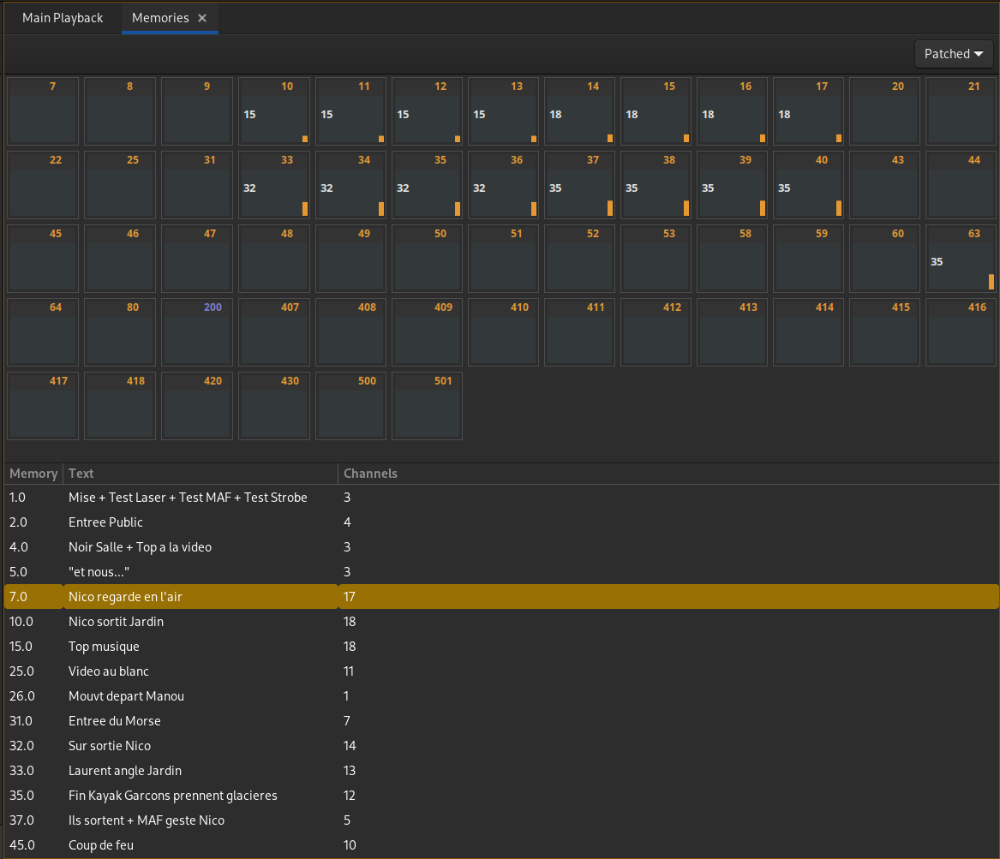

# Mémoires
Une mémoire contient des circuits avec des niveaux supérieurs à 0.  
Elle est définie par un numéro (1.0, 7.3 par exemple).  
On peut y associer un texte.

### Détail des colonnes :
- Memory : numéro de mémoire
- Text : texte de la mémoire
- Channels : Quantité de circuits utilisés dans la mémoire

## Édition de mémoires
Ouvrir l'onglet : 'Mémoires' dans le menu principal.

### Modifier une mémoire :
Sélectionner la mémoire à modifier puis sélectionner le(s) circuit(s) à modifier.

Valeur puis [=] : Mettre le(s) circuit(s) sélectionné(s) à la valeur donnée.

[!] : Augmenter la valeur du ou des circuit(s) sélectionné(s).

[:] : Baisser la valeur du ou des circuit(s) sélectionné(s).

[Maj + U] : Mettre à jour la mémoire sélectionnée.

[Suppr] : Effacer la mémoire sélectionnée. Cela supprime également les pas de séquence qui l'utilise.

Numéro puis [Maj + R] : Enregistrer une copie de la mémoire sélectionnée dans une nouvelle ayant le numéro donné.

[Insert] : Insérer une copie de la mémoire sélectionnée à la suite.

Numéro + [Insert] : Insérer une copie de la mémoire sélectionnée au numéro donné.

En cliquant sur le texte de la mémoire, il est possible de l'éditer.
> Les textes affichés dans le séquentiel sont ceux des steps, pas ceux des mémoires.