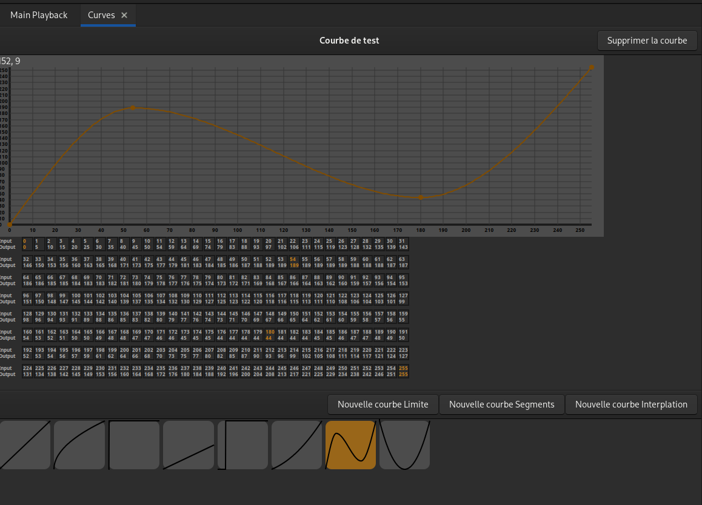
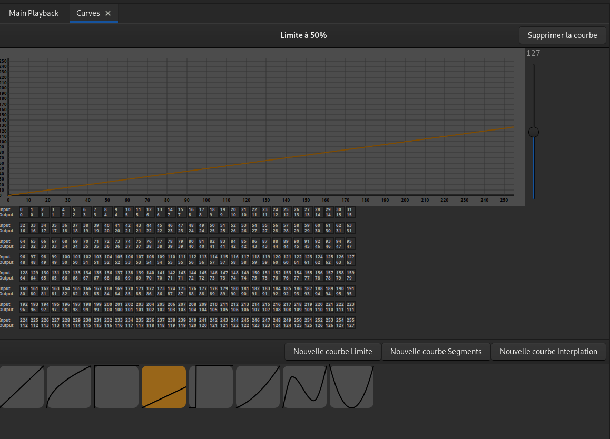
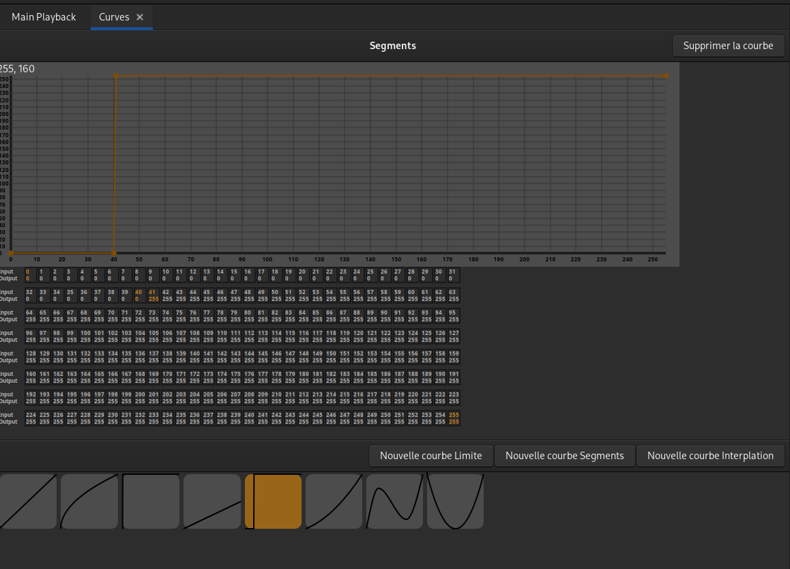

# Courbes
Une courbe peut changer la réponse des outputs.
Par défaut les outputs ont une courbe linéaire. C'est à dire que la valeur de sortie est égale à la valeur d'entrée.

## Édition de courbes

Ouvrir l'onglet : 'Courbes' dans le menu principal.

En haut, le détail de la courbe sélectionnée.
En bas, les différentes courbes existantes et des boutons pour en créer de nouvelles.

> Trois courbes existent par défaut : Linéaire, Racine carrée et Full à 1%. Ces courbes ne sont pas modifiables.

### Afficher une courbe
Cliquer sur la courbe dans la partie basse de l'onglet.  
Le dessin de cette courbe apparaît dans la partie haute de l'onglet, ainsi qu'un tableau avec le détail des valeurs DMX.

### Créer et modifier une courbe Limite
Une courbe Limite sert à limiter la valeur de sortie.  
Par exemple, une courbe Limite à 50% n'enverra que la moitié de l'intensité lumineuse quand le circuit patché serra à Full.

- Cliquer sur le bouton "Nouvelle courbe Limite".
- À l'aide du fader à droite de la courbe, spécifier la valeur maximale désirée.
> Ce sont les valeurs DMX qui sont utilisées, entre 0 et 255.

### Créer et modifier une courbe Segments
Une courbe Segments est définie par des points et les lignes droites qui les relient.  
Les points apparaissent sur le dessin de la courbe et dans le tableau de valeurs.

- Cliquer sur le bouton "Nouvelle courbe Segments".
- Pour créer un nouveau point, cliquer en maintenant [Shift] sur le dessin de la courbe.
- Pour déplacer un point, le cliquer avec la souris et le déplacer ou avec les flèches du clavier
- Il est également possible de sélectionner un point avec [PageUp] et [PageDown] du clavier

### Créer et modifier une courbe Interpolation
Une courbe Interpolation est définie par des points et les courbes qui les relient.  
Les points apparaissent sur le dessin de la courbe et dans le tableau de valeurs.

- Cliquer sur le bouton "Nouvelle courbe Interpolation".
- Pour créer un nouveau point, cliquer en maintenant [Shift] sur le dessin de la courbe.
- Pour déplacer un point, le cliquer avec la souris et le déplacer ou avec les flèches du clavier
- Il est également possible de sélectionner un point avec [PageUp] et [PageDown] du clavier

### Supprimer une courbe
- Sélectionner la courbe
- Cliquer sur "Supprimer la courbe"
> Les outputs qui utilisent la courbe supprimée repassent automatiquement en courbe Linéaire.