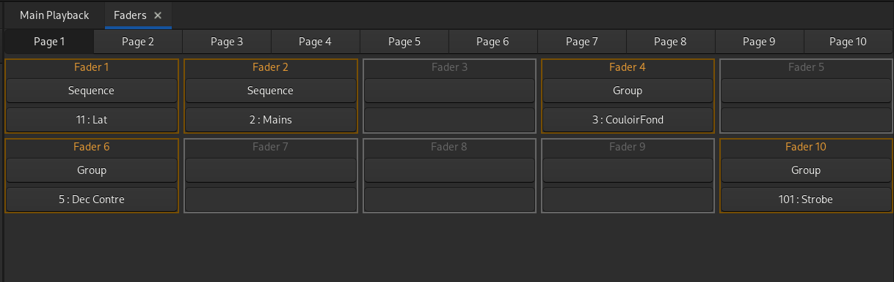

# Faders
Open Lighting Console gère 10 pages de 10 faders.

Un fader peut contenir :
- un groupe
- une mémoire
- un chenillard
- le Main Fader (souvent appelé Grand Master)

Les 10 pages de faders.  
Les 10 faders de la page sélectionnée.
- En gris, le fader n'est pas affecté
- En doré, le fader est affecté
	
## Édition des faders

Ouvrir l'onglet : [Ctrl + F] ou 'Faders' dans le menu principal.

Cliquer sur la page à modifier.

### Changer le type d'un fader :
Cliquer sur le bouton sous le nom du fader pour sélectionner le type de contenu.

### Changer le contenu d'un fader :
Pour les faders contenant un groupe, une mémoire ou une séquence, cliquer sur le bouton en dessous du type pour sélectionner le contenu.