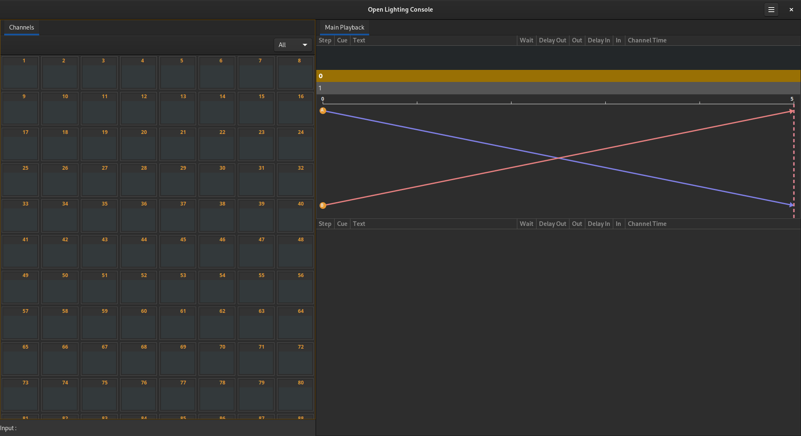
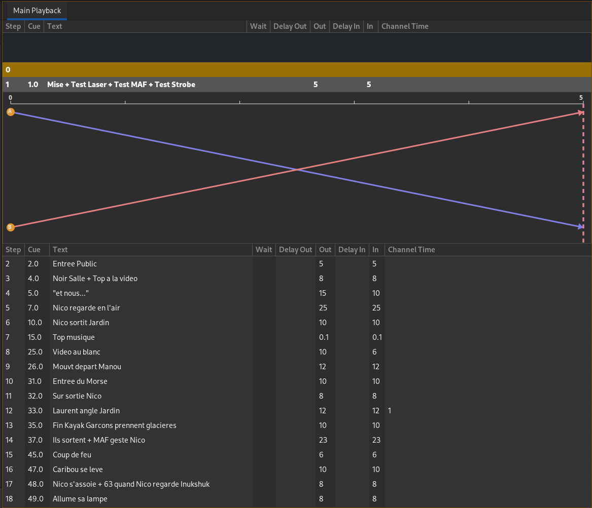

# Bases du système

## Open Lighting Architecture
[OLA](https://www.openlighting.org/ola/) est nécessaire au fonctionnement d'olc. Pour simplifier, c'est le lien entre olc et le DMX, sACN, artnet, et d'autres protocoles moins courants.  
Au démarrage, Open Lighting Console lancera automatiquement olad, s'il ne tourne pas déjà.  
Pour configurer OLA, utiliser l'interface web en suivant le lien [http://localhost:9090](http://localhost:9090) une fois olad lancé.  
Il est possible de préciser un autre port pour l'interface web d'OLA en lançant olc en ligne de commande, par exemple :
```bash
$ olc --http-port 6000
```

## Fenêtre principale

### Channels
Affiche les niveaux des circuits envoyés.
> Les circuits non patchés auront un niveau à 0

#### Trois modes d'affichage :
- All : affiche tous les circuits
- Patched : affiche les circuits patchés
- Active : affiche les circuits actifs. C'est à dire, les circuits avec une valeur dans la mémoire actuelle ou la suivante et les circuits sélectionnés.

#### Sélectionner des circuits :
- Sélectionner le circuit 1 : `1 Ch` ou [1] [C]
- Sélectionner les circuits de 1 à 10 : `1 Ch 10 Thru` ou [1] [C] [1] [0] [>]
- Sélectionner les circuits 1, 3 et 5 : `1 Ch 3 + 5 +` ou [1] [C] [3] [+] [5] [+]
- Sélectionner les circuits de 1 à 5 et de 7 à 10 : `1 Ch 10 Thru 6 -` ou [1] [C] [1] [0] [>] [6] [-]

#### Donner un niveau à des circuits :
- Circuit 1 à Full : `1 Ch 100 @` ou [1] [C] [1] [0] [0] [=]
- Circuits de 1 à 5 à 50% : `1 Ch 5 Thru 50 @` ou [1] [C] [5] [>] [5] [0] [=]
- Ajouter 5% aux circuits sélectionnés : `+%` ou [!]
- Retirer 5% aux circuits sélectionnés : `-%` ou [:]
> les valeurs de `+%` et `-%` peuvent être modifiées dans les Paramètres

### Main Playback
Affiche la séquence principale.


En haut, avec le fond doré, la mémoire en scène.  
En dessous, avec le fond gris, la prochaine mémoire.  
Ensuite, une représentation graphique de la transition entre les deux mémoires.  
Enfin, les mémoires suivantes.

#### Détails des colonnes :
- Step : numéro de pas dans la séquence
- Cue : numéro de la mémoire
- Text : texte du pas de séquence
- Wait : temps avant de lancer automatiquement le pas suivant
- Delay Out : délais d'attente avant de baisser les niveaux de circuits
- Out : temps de la baisse des niveaux de circuits
- Delay In : délais d'attente avant de monter les niveaux de circuits
- In : temps de monté des niveaux de circuits
- Channel Time : Nombre de circuits avec un channel time
> Tous les temps sont exprimés en secondes.

#### Modifier des Pas et des Mémoires :

Une mémoire stocke les niveaux des circuits

- Enregistrer une mémoire avec le prochain numéro de libre :  `Record` ou [Maj + R]
- Enregistrer la mémoire 10 :  `10 Record` ou [1] [0] [Maj + R]
- Mettre à jour la mémoire active : `Update` ou [Maj + U]

Un pas contient une mémoire et des temps

- Définir un temps de montée de 3s : [3] [Maj + I]
- Définir un temps de descente de 2s : [2] [Maj + O]
- Définir un temps de montée et de descente de 10s : [1] [0] [Maj + T]
- Définir un délai sur la montée de 1s : [1] [Maj + K]
- Définir un délai sur la descente de 2s : [2] [Maj + L]
- Définir un délai sur la montée et la descente de 3s : [3] [Maj + D]
- Définir un wait de 0.5s : [0] [.] [5] [Maj + W]

#### Se déplacer dans la séquence principale :
- Go: `Go` ou [Ctrl + G]
- Sauter au prochain pas : `Seq+` ou [W]
- Sauter au pas précédent : `Seq-` ou [Q]
- Aller à la mémoire 2.0 (la mémoire doit exister) : `2 Goto` ou [2] [Maj + G]
- Revenir au pas précédent :  `Go Back` ou [Ctrl + B]
> Le temps du Go Back Time peut être modifié dans les Paramêtres

## Divers :
- La partie active est entourée d'un cadre doré. La touche [Tab] permet de la changer.
- Pour effacer le buffer clavier : [Backspace]
- Pour fermer un onglet : cliquer avec la souris sur la croix de l'onglet ou [Esc]