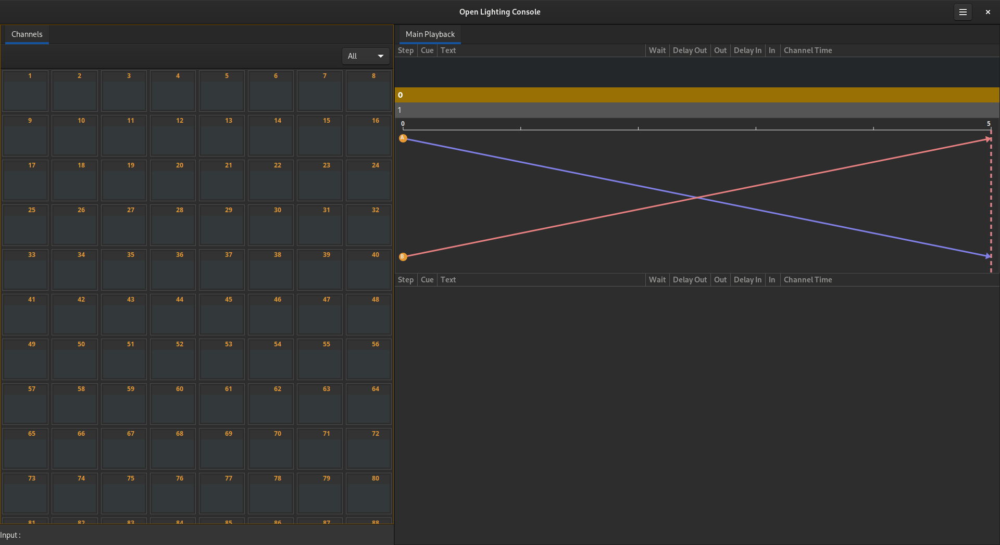
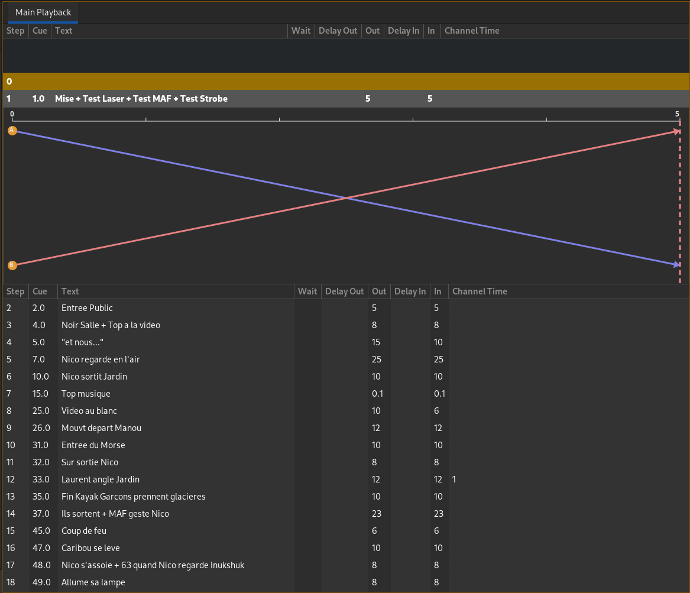

# Bases du système

## Installation

- Vous pouvez l'installer depuis flathub.org en suivant les instructions sur
[cette page](https://flathub.org/apps/com.github.mikacousin.olc).  
Normalement, cette version doit s'installer sur toutes les distributions Linux. De plus, elle contient toutes les dépendances dont olc a besoin.

- Si vous utiliez Archlinux, un paquet
[AUR](https://aur.archlinux.org/packages/olc-git) est disponible.

- Toute aide pour créer des paquets pour d'autres distributions est la bienvenue.

## Moteur DMX unifié (CoreEngine)
Pour piloter votre matériel d'éclairage, olc intègre désormais un moteur de communication réseau unifié à haute performance (**CoreEngine**).

Ce moteur fonctionne en tâche de fond de manière autonome et sécurisée. olc émet les trames de chaque univers physique dans les protocoles réseau standard :

### sACN (E1.31)
Le moteur réseau intègre nativement le protocole de diffusion **sACN** pour le contrôle d'équipements sur le réseau local.

### ArtNet
Le moteur réseau émet également en parallèle dans le protocole standard **ArtNet** pour la communication directe avec les nœuds et projecteurs compatibles.

### Matériel DMX Physique (ENTTEC USB Pro)
La console prend en charge de façon native et plug-and-play les interfaces physiques USB DMX (telles que le boîtier **ENTTEC DMX USB Pro**) en routant le flux DMX directement sur le port configuré.

### Supervision en temps réel (ZeroMQ)
Un flux de supervision ZeroMQ est disponible (sur le port `5555`) et publie en temps réel l'ensemble des trames DMX et métriques de fréquence de chaque univers pour des outils externes d'analyse ou de visualisation.

## Fenêtre principale

### Channels
Affiche les niveaux des circuits envoyés.
> Les circuits non patchés auront un niveau à 0

#### Trois modes d'affichage :
- All : affiche tous les circuits
- Patched : affiche les circuits patchés
- Active : affiche les circuits actifs. C'est à dire, les circuits avec une valeur dans la mémoire actuelle ou la suivante et les circuits sélectionnés.

#### Sélectionner des circuits :
- Sélectionner le circuit 1 : `1 Ch` ou [1] [C]
- Sélectionner les circuits de 1 à 10 : `1 Ch 10 Thru` ou [1] [C] [1] [0] [>]
- Sélectionner les circuits 1, 3 et 5 : `1 Ch 3 + 5 +` ou [1] [C] [3] [+] [5] [+]
- Sélectionner les circuits de 1 à 5 et de 7 à 10 : `1 Ch 10 Thru 6 -` ou [1] [C] [1] [0] [>] [6] [-]

#### Donner un niveau à des circuits :
- Circuit 1 à Full : `1 Ch 100 @` ou [1] [C] [1] [0] [0] [=]
- Circuits de 1 à 5 à 50% : `1 Ch 5 Thru 50 @` ou [1] [C] [5] [>] [5] [0] [=]
- Ajouter 5% aux circuits sélectionnés : `+%` ou [!]
- Retirer 5% aux circuits sélectionnés : `-%` ou [:]
> les valeurs de `+%` et `-%` peuvent être modifiées dans les Paramètres

### Main Playback
Affiche la séquence principale.

En haut, avec le fond doré, la mémoire en scène.  
En dessous, avec le fond gris, la prochaine mémoire.  
Ensuite, une représentation graphique de la transition entre les deux mémoires.  
Enfin, les mémoires suivantes.

#### Détails des colonnes :
- Step : numéro de pas dans la séquence
- Cue : numéro de la mémoire
- Text : texte du pas de séquence
- Wait : temps avant de lancer automatiquement le pas suivant
- Delay Out : délai d'attente avant de baisser les niveaux de circuits
- Out : temps de la baisse des niveaux de circuits
- Delay In : délai d'attente avant de monter les niveaux de circuits
- In : temps de monté des niveaux de circuits
- Channel Time : Nombre de circuits avec un channel time
> Tous les temps sont exprimés en secondes.

#### Modifier des Pas et des Mémoires :

Une mémoire stocke les niveaux des circuits

- Enregistrer une mémoire avec le prochain numéro de libre : `Record` ou [R] / [Maj + R]
- Enregistrer la mémoire 10 : `10 Record` ou [1] [0] [R] / [Maj + R]
- Mettre à jour la mémoire active : `Update` ou [U] / [Maj + U]

Un pas contient une mémoire et des temps

- Définir un temps de montée de 3s : [3] [I] / [Maj + I]
- Définir un temps de descente de 2s : [2] [O] / [Maj + O]
- Définir un temps de montée et de descente de 10s : [1] [0] [T] / [Maj + T]
- Définir un délai sur la montée de 1s : [1] [K] / [Maj + K]
- Définir un délai sur la descente de 2s : [2] [L] / [Maj + L]
- Définir un délai sur la montée et la descente de 3s : [3] [D] / [Maj + D]
- Définir un wait (attente) de 0.5s : [0] [.] [5] [X] / [Maj + X]

#### Se déplacer dans la séquence principale :
- Go (lancer la transition) : `Go` ou la touche [Espace]
- Pause (suspendre la transition) : `Pause` ou [Ctrl + Espace]
- Sauter au prochain pas : `Seq+` ou [w] / [W]
- Sauter au pas précédent : `Seq-` ou [q] / [Q]
- Aller à la mémoire 2.0 (la mémoire doit exister) : `2 Goto` ou [2] [g] / [2] [Maj + G]
- Revenir au pas précédent : `Go Back` ou [Ctrl + B]
> Le temps du Go Back Time peut être modifié dans les Paramètres

## Divers :
- Annuler la dernière action (Undo) : [Ctrl + Z]
- Rétablir la dernière action annulée (Redo) : [Ctrl + Shift + Z] ou [Ctrl + Y]
- La touche [Tab] permet de changer la partie active (focus).
- Pour effacer le buffer clavier : [Backspace]
- Pour fermer un onglet : cliquer avec la souris sur la croix de l'onglet ou [Esc]
- Pour passer l'application en plein écran : [F11]
