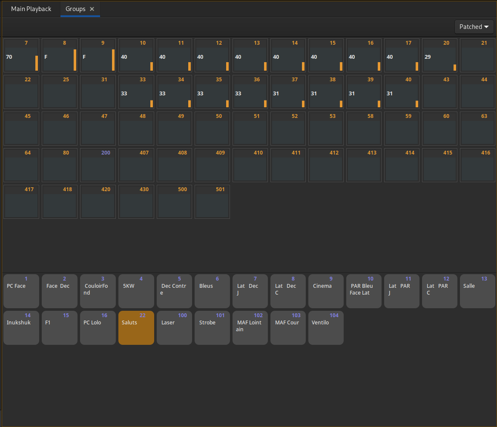

# Groupes
Un groupe est une sélection de circuits ayants un niveau supérieur à 0.

Les groupes doivent avoir un numéro. Celui-ci peut être de la forme '1.5'.

## Édition des groupes

Ouvrir l'onglet : [Shift + Ctrl + G] ou 'Groupes' dans le menu principale.

### Créer un nouveau groupe :
[N] : Créer un nouveau groupe à la suite des autres.

Numéro puis [N] : Créer le groupe Numéro.

### Effacer un groupe :

[Suppr] : Effacer le groupe sélectionné.

### Sélectionner un groupe :

Numéro puis [G] : Sélectionner le groupe.

[←] [↑] [→] [↓] : Changer le groupe sélectionné.

### Modifier un groupe :

> Les modifications sur les circuits des groupes sont effectuées en temps réel. Si le groupe est envoyé dans un master, elles seront effectives immédiatement.

Valeur puis [=] : Mettre le(s) circuit(s) sélectionné(s) à la valeur donnée.

[!] : Augmenter la valeur du ou des circuit(s) sélectionné(s).

[:] : Baisser la valeur du ou des circuit(s) sélectionné(s).

[L] : Changer le texte du groupe, [Entrée] pour confirmer, [Esc] pour abandonner.