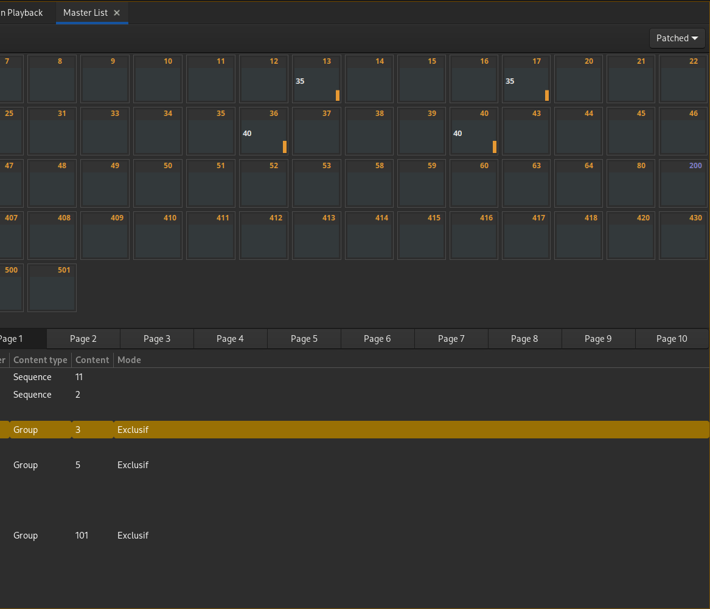

# Masters
Un master correspond à un fader de la console virtuelle.

Open Lighting Console gère 10 pages de 10 masters.

Un master peut contenir :
- un groupe
- une sélection de circuits avec des niveaux
- une mémoire
- un chenillard

Cet onglet est divisé en 2 parties :
- En haut : les circuits présents dans le master (groupe, circuits, mémoire)
- En bas : les 10 pages de masters
	- Master : numéro de master
	- Content type, le type de master :
		- Vide : master inutilisé
		- Preset : un mémoire
		- Channels : des circuits
		- Sequence : un chenillard
		- Group : un groupe
	- Content : suivant le type, le numéro du chenillard, de la mémoire, du groupe ou pour les circuits le nombre de circuits présents
	- Mode : inutilisé pour l'instant

## Édition des masters

Ouvrir l'onglet : [Ctrl + M] ou 'Masters' dans le menu principal.

### Changer le type de master :
Sélectionner le master.

Cliquer sur la colonne 'Content type' du master sélectionné et choisir le type de master.

### Changer le contenu d'un master :
Sélectionner le master.

Cliquer sur la colonne 'Content' du master sélectionné et entrer le numéro de l'élément à utiliser.

### Modifier les circuits d'un master groupe, circuits ou mémoire :
Sélectionner le(s) circuit(s) à modifier.

- Valeur puis [=] : mettre à la valeur
- [!] : augmenter la valeur
- [:] : baisser la valeur
- [Maj + U] ou [Maj + R] : mettre à jour le groupe, les circuits ou la mémoire