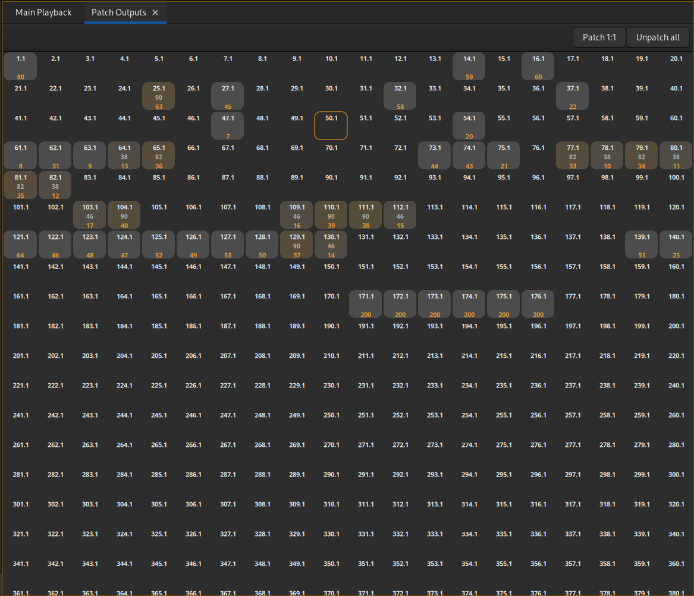
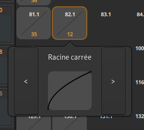
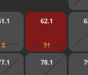

# Patch

## Outputs:  

Ouvrir l'onglet : [Ctrl + P] ou 'Patch' dans le menu principal.

### Sélectionner un output :  

- Clique souris : sélectionne un output
- Clique souris + Maj : sélectionne la série entre les deux
- Clique souris + Ctrl : Ajoute / Retire l'output de la sélection
- Numéro puis [O] : sélectionne l'output
- Numéro puis [>] : Thru
- Numéro puis [+] : ajoute l'output
- Numéro puis [-] : retire l'output
- Déplacement avec les flèches

> Note :  
> Output sans préciser univers : output premier univers  
> Output.univers (par exemple 10.3 pour l'output 10 de l'univers 3)

### Envoyer des outputs :  

Valeur puis [=]

### Tester les outputs :
> Note : On ne peut tester qu'un output à la fois

Valeur puis [T], ensuite déplacement avec les flèches.  
Quitter le mode test output : presser à nouveau [T] ou fermer l'onglet.

### Patcher :  
- Patch droit : Bouton 'Patch 1:1'
- Vider patch : Bouton 'Unpatch all'
- Patch un output : sélectionner output, entrer un numéro de circuit, presser [C]
- Patch multiple : sélectionner une série d'output, entrer un numéro de circuit, choisir de patcher tout sur le même circuit ou sur des circuits consécutifs.

### Changer la courbe des outputs :  
On peut choisir la [courbe](curves.md) de réponse des outputs. Par défaut la courbe est linéaire. 

- Sélectionner un ou des output(s) patché(s)
- Cliquer sur un des outputs sélectionnés
- Choisir une courbe en les faisant défiler
- Cliquer sur la courbe choisie
> Vous pouvez appuyer sur la touche [Esc] pour fermer ce popup sans faire de choix.

Un output avec une courbe à 0% apparaîtra en rouge pour signifier qu'il n'enverra jamais de valeur DMX.