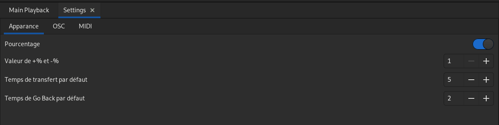
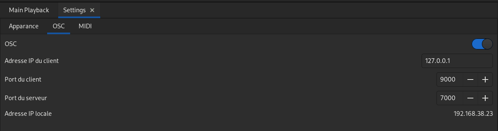

# Préférences

Ouvrir l'onglet : 'Préférences' dans le menu principal.

## Apparence

### Pourcentage
Activé, les valeurs des circuits sont affichées de 0 à 100%.  
Sinon, les valeurs des circuits sont affichées de 0 à 255.
### Valeur de +% et -%
Augmente ou diminue le niveau des circuits avec `+%` et `-%` de cette valeur.
### Temps de transfert par défaut
Valeur par défaut, en secondes, du temps de transfert.
### Temps de Go Back par défaut
Valeur par défaut, en secondes, du temps de retour en arrière dans la séquence.

## OSC

Voir [Open Sound Control](osc.md).

### OSC
Vous pouvez activer ou non l'OSC.
### Adresse IP du client
Adresse IP de l'appareil distant (la télécommande par exemple).
### Port du client
Port sur lequel le client reçoit les infos.
### Port du serveur
Port sur lequel olc reçoit les infos.
### Adresse IP locale
Affichage de l'adresse IP de la machine sur laquelle olc est exécutée.

## MIDI

Voir [Contôleurs MIDI](midi.md).

Activer le(s) contrôleur(s) MIDI et choisir le mode pour les rotatifs.
