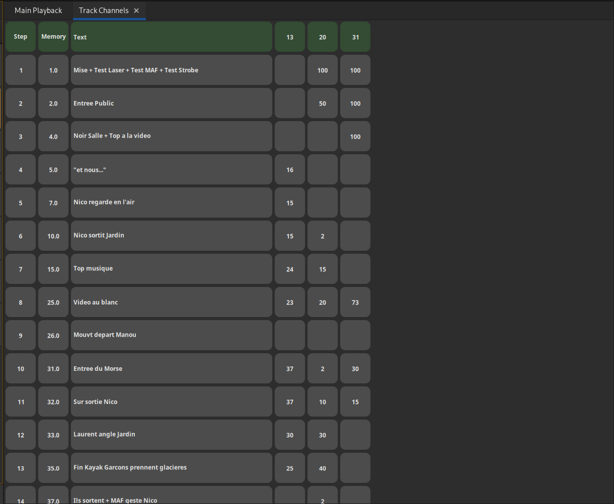

# Suivi de circuits

Le suivi de circuits permet d'afficher l'utilisation de circuits au cour de la séquence principale.

Ouvrir l'onglet : [Maj + Ctrl + T] ou 'Suivi de circuits' dans le menu principal.

### Sélectionner les circuits :
- Numéro puis [C] : sélectionner circuit Numéro
- Numéro puis [+] : ajouter circuit Numéro à la sélection
- Numéro puis [-] : retirer circuit Numéro de la sélection
- Numéro puis [>] : sélectionner entre le circuit précédemment sélectionné et le circuit Numéro
- [←] [→] : changer de colonne de circuits
- [↑] [↓] : changer de pas de séquence

### Modifier un circuit :
Valeur puis [=] : met le circuit sélectionné au pas de séquence sélectionné à la valeur donnée
